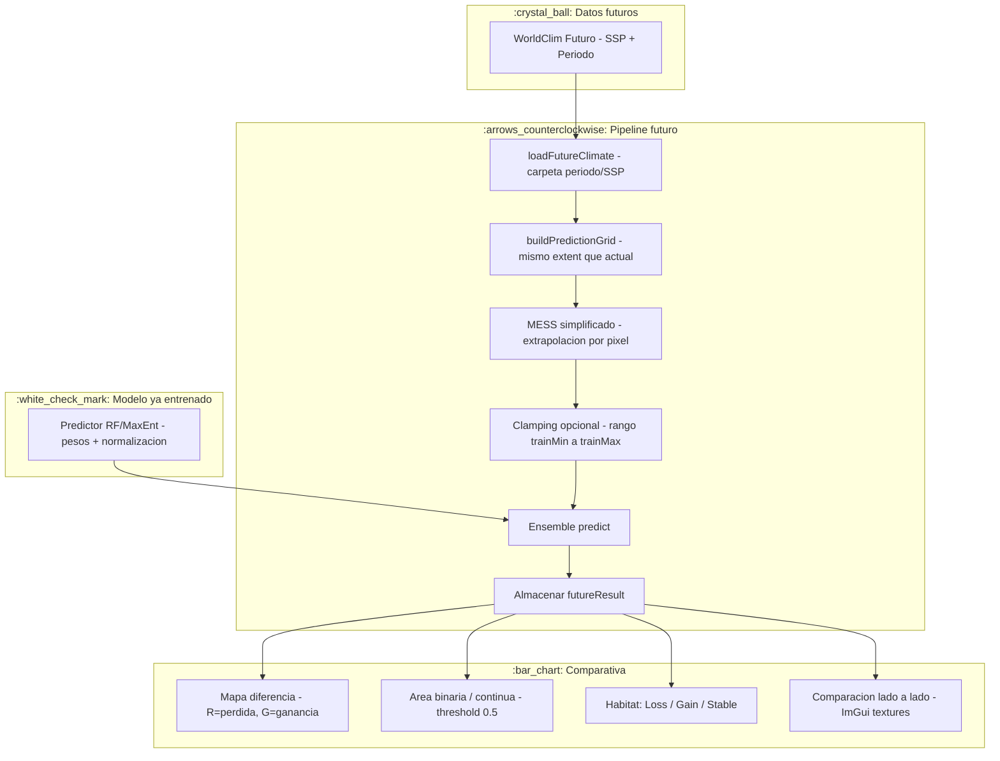

# Memoria Tecnica — Modulo de Prediccion de Especies (SDM)

## Resumen Ejecutivo

Este documento recoge la totalidad del diseno, implementacion y evolucion del **modulo de Prediccion de Especies** (*Species Distribution Modeling*, SDM) integrado en el motor **GEU** (C++17/OpenGL). El modulo permite cargar registros de ocurrencia (GBIF), variables bioclimaticas actuales y futuras (WorldClim 2.1), entrenar modelos de Machine Learning (Random Forest y MaxEnt), proyectar distribuciones bajo escenarios climaticos futuros (SSP1-2.6 a SSP5-8.5), visualizar los resultados en 2D/3D dentro del entorno GEU, analizar el perfil de nicho ecologico mediante **curvas de respuesta** con exportacion a CSV y PNG, persistir resultados en multiples formatos (GeoTIFF RGB, GeoJSON, PNG de heatmap y diferencias, JSON de metricas y configuracion), y exportar la **nube de puntos 3D a PLY** para visualizacion web externa.

Todo el desarrollo se ha realizado sobre la arquitectura existente de GEU, respetando la inmutabilidad de `GEUCore` y extendiendo funcionalidad exclusivamente desde `GEUModules/PrediccionEspecies/`.

---

## 1. Stack Tecnologico y Dependencias

| Capa | Tecnologia | Version / Uso |
|------|-----------|---------------|
| **Lenguaje** | C++ | C++17 (modulo), C++20 (flags de compilacion en PCH) |
| **Build** | Premake5 + MSBuild | Solucion `GEU Engine.sln` |
| **Gestor de paquetes** | vcpkg | GDAL 3.9.3, OpenCV 4.x, spdlog |
| **GIS / Raster** | GDAL | Lectura/escritura GeoTIFF, reproyeccion, extraccion de valores puntuales |
| **Machine Learning** | OpenCV `cv::ml` | `RTrees` (Random Forest), regresion logistica custom (MaxEnt) |
| **GUI** | ImGui + ImPlot | Paneles, tablas, graficos ROC, barras de importancia, combos, curvas de respuesta |
| **UI Core** | GEUCore | `InterfaceAdapter`, `GuiUtilities::ProgressBar`, `PopupSystem`, `LocaleStrings` |
| **3D / Visualizacion** | GEUCore (OpenGL) | `PointCloud`, `Texture`, `Scene`, `Renderer` |
| **Logging** | spdlog | Logs estructurados con niveles debug/info/warn/error |
| **Datos bioclimaticos** | WorldClim 2.1 | 19 variables BIO (30 arc-sec, ~1 km) actuales y futuras CMIP6 |
| **Ocurrencias** | GBIF CSV | Formato Darwin Core simplificado (species, decimalLongitude, decimalLatitude) |
| **DEM** | SRTM / GeoTIFF | Elevacion, pendiente y orientacion via algoritmo de Horn 3x3 |
| **Exportacion raster** | GDAL + OpenCV | GeoTIFF RGB (GDAL), PNG de curvas (OpenCV `imgcodecs`) |

---

## 2. Arquitectura del Modulo

El diseno sigue los patrones **Singleton** (orquestador), **Strategy** (modelos intercambiables) y **Facade** (simplificacion de la interfaz publica).

```text
+-----------------------------------------------------------------------------+
|                         PREDICCION DE ESPECIES (SDM)                        |
+-----------------------------------------------------------------------------+
|  UI Layer (ImGui)                                                           |
|  +- PrediccionEspeciesGUIAdapter  <-  InterfaceAdapter                       |
|  |   +- renderDataLoadingSection()                                          |
|  |   +- renderConfigurationSection()                                        |
|  |   +- renderTrainingSection()                                             |
|  |   +- renderScenarioSection()                                             |
|  |   +- renderResultsSection()                                              |
|  |   +- renderResponseCurvesSection()    <-- NUEVO                          |
|  |   +- runAsync() / checkAsyncCompletion()                                 |
|  |   +- cacheScenario() / switchToScenario()                                |
|  +- LocaleStrings (GEUCore)  <-  GEU_langs.csv                              |
+-----------------------------------------------------------------------------+
|  Controller / Facade                                                        |
|  +- SimulationManager (Singleton)                                           |
|  |   +- loadOccurrences() / loadCurrentClimate() / loadFutureClimate()      |
|  |   +- trainModel() / trainModelWithCrossValidation()                      |
|  |   +- analyzeVariableSelection()                                          |
|  |   +- runPrediction() / changeScenario()                                  |
|  |   +- computeResponseCurves()            <-- NUEVO                        |
|  |   +- exportResultsCSV() / exportResultsGeoJSON()                         |
|  |   +- exportResultsGeoTIFF() / exportResultsGeoTIFFAuto() <-- NUEVO       |
|  |   +- exportResponseCurvesCSV() / exportResponseCurvesPNG() <-- NUEVO     |
|  |   +- exportMetricsJSON() / exportConfigJSON()           <-- NUEVO       |
|  |   +- exportDifferenceTablesJSON()                        <-- NUEVO       |
|  |   +- exportPointCloudPLY() via FileManager::savePointCloud() <-- NUEVO |
+-----------------------------------------------------------------------------+
|  Data & Preprocessing                                                       |
|  +- ClimateDataHandler                                                      |
|  |   +- buildTrainingMatrix()      ->  cv::Mat + labels                     |
|  |   +- buildPredictionGrid()      ->  cv::Mat + coords<lon,lat>            |
|  |   +- extractFeaturesAtPoint()   ->  19 BIO (+ DEM)                       |
|  |   +- generateBackgroundPoints() ->  pseudo-ausencias                     |
|  |   +- getTrainFeatureMin/Max/Mean()  <-- NUEVO                            |
|  +- GeoDataLoader (GDAL)                                                    |
|  |   +- loadGeoTIFF() / loadMultibandGeoTIFF()                              |
|  |   +- loadCSV()                                                           |
|  +- DEMFeatureExtractor                                                     |
|  |   +- extractElevation() / extractSlope() / extractAspect()               |
|  +- FeatureSelector                                                         |
|  |   +- analyze()  ->  Correlacion Pearson + VIF (SVD)                      |
+-----------------------------------------------------------------------------+
|  ML Models (Strategy: IPredictionModel)                                     |
|  +- ForestPredictor  ->  OpenCV RTrees + Platt calibration                  |
|  +- MaxEntPredictor  ->  L2 Logistic Regression + quadratic features        |
+-----------------------------------------------------------------------------+
|  Evaluation & Metrics                                                       |
|  +- CrossValidator  ->  K-Fold estratificado                                |
|  +- MetricsCalculator                                                       |
|  |   +- Accuracy, Precision, Recall, F1, TSS, Kappa, AUC/ROC                |
+-----------------------------------------------------------------------------+
|  Visualization                                                              |
|  +- HeatmapGenerator (static)                                               |
|  |   +- generateHeatmapTexture()   ->  Custom colormap, bicubic 4-10x       |
|  |   +- generateHeatmapPointCloud()->  Z = probabilidad x DEM               |
|  |   +- generateDifferenceTexture()->  R=perdida, G=ganancia                 |
|  |   +- exportHeatmapPNG() / exportDifferencePNG()         <-- NUEVO       |
|  |   +- calculateOccupiedArea() / calculateHabitatLossGainStable()          |
|  +- FileManager (GEUCore)                                                   |
|  |   +- savePointCloud() -> PLY (x,y,z,r,g,b)              <-- NUEVO       |
+-----------------------------------------------------------------------------+
```

---

## 3. Diagrama de Flujo Completo

### 3.1. Prediccion Actual (Clima Presente)

```mermaid
flowchart TB
    subgraph Entrada[":inbox_tray: Datos de entrada"]
        A["GBIF CSV - species, lon, lat"]
        B["WorldClim Actual - 19 BIO + DEM"]
    end

    subgraph Preproceso[":wrench: Preproceso"]
        C["GeoDataLoader - parseDoubleSafe"]
        D["Spatial Thinning - 1 punto / celda km"]
        E["ClimateDataHandler - buildTrainingMatrix"]
        F["Pseudo-ausencias - 2x presencias, 25 km buffer"]
        G["FeatureSelector - Pearson + VIF"]
    end

    subgraph Entrenamiento[":brain: Entrenamiento"]
        H{Algoritmo}
        H -->|RF| I["ForestPredictor - RTrees 250 arboles, depth=7"]
        H -->|MaxEnt| J["MaxEntPredictor - L2 SGD, class weighting, T=3.0"]
    end

    subgraph Prediccion[":world_map: Prediccion Espacial"]
        K["Calcular extent - DEM o bbox ocurrencias + 1.5 grados"]
        L["buildPredictionGrid - iterar pixeles validos"]
        M["Ensemble predict - media + sigma por pixel"]
        N["Almacenar PredictionResult"]
    end

    subgraph Visualizacion[":eye: Visualizacion"]
        O["Heatmap 2D texture - Custom colormap"]
        P["PointCloud 3D - DEM Z x probabilidad"]
        Q["Tablas metricas + ROC + mapa diferencia"]
        R["Response Curves - sweep sintetico + ImPlot"]  <-- NUEVO
    end

    A --> C --> D --> E
    B --> E
    E --> F --> G
    G --> H
    I --> M
    J --> M
    B --> K --> L --> M --> N
    N --> O & P & Q & R
```

### 3.2. Prediccion Futura (Escenario SSP)



---

## 4. Componentes en Detalle

### 4.1. `SimulationManager` — Orquestador Singleton

**Rol:** Facade que expone una API minima al GUI y oculta toda la complejidad del pipeline.

**Decisiones clave:**
- **Singleton:** Garantiza que solo exista un estado de simulacion activo en todo momento. Evita conflictos de memoria y recursos GDAL abiertos.
- **Maquina de estados:** `SimulationState` (Idle, Loading, Training, Predicting, Error) permite deshabilitar botones de forma segura.
- **Ensemble:** `_ensembleSize` modelos (por defecto 1). Cada modelo recibe una semilla diferente para pseudo-ausencias (`12345 + e`) y jittering geografico opcional (+/-500 m). Esto aumenta la robustez sin complicar la UI.

**Metodos principales:**

| Metodo | Descripcion tecnica |
|--------|---------------------|
| `loadOccurrences(csvPath)` | Parsea CSV con `GeoDataLoader`, aplica `thinOccurrences()` (grid espacial 1 km), filtra puntos fuera del extent climatico. |
| `loadCurrentClimate(directory)` | Carga 19 GeoTIFFs de WorldClim. Si el raster es global (>3x el extent de estudio), auto-recorta para ahorrar RAM. |
| `loadFutureClimate(dir, ssp, period)` | Carga variables futuras del mismo ensemble de GCMs. Ruta: `DataPredictionSpecies/Futuro/<periodo>/<ssp>/`. |
| `trainModel(numBg)` | Construye matriz de entrenamiento, aplica seleccion de variables si esta activa, entrena ensemble. |
| `trainModelWithCrossValidation(k, numBg)` | K-Fold estratificado: clona predictor por fold, entrena con (K-1)/K, valida con 1/K. Al final, reentrena modelo definitivo con TODO el dataset. |
| `runPrediction(useFutureClimate)` | Ver Seccion 5. |
| `computeResponseCurves(numPoints=200)` | **NUEVO.** Para cada variable activa, genera un sweep sintetico (min..max) con el resto fijas en la media del entrenamiento. Predice con el ensemble completo y promedia. |
| `exportResultsGeoTIFF(path, result)` | **NUEVO.** Exporta raster RGB (3 bandas, Byte) con colormap custom (gamma 0.35) + WGS84 + geotransform. |
| `exportResultsGeoTIFFAuto(outputDir, result)` | **NUEVO.** Genera nombre automatico: `Especie_Algoritmo_Actual.tif` o `Especie_Algoritmo_SSP_Periodo.tif`. |
| `exportResponseCurvesCSV(outputDir, curves)` | **NUEVO.** Unico CSV con columnas `Variable,Description,Value,Probability,MeanReference,Min,Max`. |
| `exportResponseCurvesPNG(outputDir, curves)` | **NUEVO.** Un PNG por curva (900x550, estilo oscuro, ejes, grid, linea de respuesta azul, linea roja en la media). |
| `exportResultsGeoJSON(path)` | RFC 7946 FeatureCollection. Cada punto es una Feature con propiedades: `probability`, `species`, `algorithm`, `scenario`, `period`, y metricas del modelo (AUC, Accuracy, etc.). |

### 4.2. `ClimateDataHandler` — Gestor de Datos Climaticos

**Rol:** Abstrae todo el acceso a rasters bioclimaticos y DEM.

**Metodos clave:**

**`buildTrainingMatrix(occurrences, numBg)`**
1. Extrae las 19 variables BIO (+ DEM si esta cargado) en cada coordenada de presencia.
2. Genera `numBg` pseudo-ausencias. Por defecto: `2 x n_presencias`.
3. Las pseudo-ausencias se generan dentro de un **buffer de 25 km** alrededor de las presencias, con separacion minima de 1 km.
4. Anade **ruido gaussiano del 10%** a las features para evitar memorizacion de coordenadas exactas.
5. Almacena `trainFeatureMin` / `trainFeatureMax` para MESS y clamping posterior.
6. **NUEVO:** Almacena `trainFeatureMean` para el calculo de curvas de respuesta.

**`buildPredictionGrid(useFuture, targetExtent)`**
1. Itera la ventana del raster que intersecta con `targetExtent`.
2. Salta pixeles `NODATA`.
3. Devuelve `cv::Mat` de features (filas = pixeles, cols = variables) y `vector<pair<double,double>>` de coordenadas (lon, lat).

**`extractFeaturesAtPoint(lat, lon)`**
- Usa GDAL `RasterIO` con bilineal para extraer el valor de cada banda en una coordenada WGS84.
- Si hay DEM, incluye elevacion (bilineal), pendiente y orientacion (Horn 3x3).

### 4.3. `GeoDataLoader` — Facade GDAL

- **`loadGeoTIFF()` / `loadMultibandGeoTIFF()`**: Carga con `GDALDataset`, soporta recorte por extent, reutiliza `GDALDatasetH`.
- **`loadCSV()`**: Parsea linea a linea. Usa `parseDoubleSafe()` — una funcion custom que evita `std::stod` (que trunca en sistemas con locale de coma decimal, como `es-ES`).

### 4.4. `DEMFeatureExtractor` — Lectura On-Demand

**Diseno:** No carga el DEM completo en RAM. Mantiene handles GDAL abiertos y lee pixeles bajo demanda.

**Algoritmo de Horn (3x3)** para pendiente/aspecto:
```
dz/dx = ((z9 + 2z6 + z3) - (z7 + 2z4 + z1)) / (8 x cellsize)
dz/dy = ((z7 + 2z8 + z9) - (z1 + 2z2 + z3)) / (8 x cellsize)
pendiente = atan(sqrt(dz/dx^2 + dz/dy^2)) x 180/pi
aspecto = atan2(dz/dy, -dz/dx) x 180/pi
```

---

## 5. Flujo de Prediccion (`runPrediction`) en Profundidad

Este metodo es el corazon del modulo. Aqui desglosamos paso a paso la prediccion actual y futura.

### 5.1. Determinacion del Extent

```cpp
if (hasDEM() && _clipToDEMExtent) {
    _predictionExtent = _climateHandler.getDEMExtent();
} else if (!_occurrences.empty()) {
    // Bounding box de ocurrencias + margen configurable (default 1.5 grados)
    _predictionExtent = occurrenceBbox + margin;
    clampToGeoLimits(-180, 180, -90, 90);
} else {
    _predictionExtent = _climateHandler.getExtent();
}
```

**Por que:** Recortar el area de prediccion es crucial para:
- Reducir el tiempo de calculo (menos pixeles).
- Mantener coherencia topografica (si hay DEM, el extent del DEM define el area de estudio).
- Evitar predicciones en zonas geograficas donde la especie nunca ha sido observada (a menos que el usuario quiera explorar).

### 5.2. Construccion de la Grid

`buildPredictionGrid(useFutureClimate, _predictionExtent)` itera la ventana raster recortada y construye una matriz de features. El numero de filas es el numero de pixeles validos.

### 5.3. Seleccion de Variables

Si `_useVariableSelection` es true y ya se ejecuto `analyzeVariableSelection()`, se filtran columnas:
```cpp
gridFeatures = FeatureSelector::filterColumns(gridFeatures, _selectedFeatureIndices);
```

### 5.4. MESS — Deteccion de Extrapolacion (solo futuro)

**MESS simplificado** (Multivariate Environmental Similarity Surface):
```cpp
score = sum max(0, (trainMin - v) / range, (v - trainMax) / range)
```

Para cada pixel futuro, suma la distancia relativa fuera del rango de entrenamiento. Si >50% de variables estan fuera de rango, el pixel se marca como extrapolacion fuerte.

**Por que:** Los modelos (especialmente RF) no extrapolan bien. MESS avisa al usuario de que zonas son "tierra de nadie" climaticamente.

### 5.5. Clamping (solo futuro, opcional)

```cpp
if (useFutureClimate && _useClamping) {
    gridFeatures = clamp(gridFeatures, trainMin, trainMax);
}
```

**Por que:** RF envia valores fuera de rango a nodos hoja extremos, produciendo probabilidades artificiales. Clamping fuerza a los arboles a comportarse como si el valor estuviera en el borde conocido.

> **Nota de diseno:** En la UI, el clamping se desactivo forzosamente (`setUseDEMFeature(false)`, `setClampingEnabled(false)`) porque los tests mostraron que comprimia demasiado las diferencias entre escenarios. El margen de 1.5 grados y el recorte al DEM extent ya limitan el area de prediccion de forma natural.

### 5.6. Ensemble Prediction

```cpp
for (size_t e = 0; e < _ensemblePredictors.size(); ++e) {
    ensembleProbs[e] = _ensemblePredictors[e]->predict(gridFeatures);
}
// Media y desviacion estandar del ensemble
for (each pixel i) {
    probabilities[i] = mean(ensembleProbs[*][i]);
    probStd[i] = std(ensembleProbs[*][i]);
}
```

El ensemble reduce la varianza del modelo. Con `_ensembleSize = 1`, el comportamiento es deterministico.

### 5.7. Callback de Progreso

Durante `runPrediction`, se reporta progreso real mediante `SimulationManager::reportProgress(p)`:

| Fase | Progreso |
|------|----------|
| Grid construido | 10% |
| Seleccion de variables | 15% |
| MESS + Clamping | 20% |
| Cada modelo del ensemble | 20% -> 80% |
| Promediado | 90% |
| Finalizado | 100% |

Este callback es consumido por `PrediccionEspeciesGUIAdapter`, que actualiza la barra de progreso en tiempo real.

---

## 6. Algoritmos de Machine Learning

### 6.1. Random Forest — `ForestPredictor`

**Implementacion:** `cv::ml::RTrees` de OpenCV.

**Hiperparametros:**
| Parametro | Valor | Justificacion |
|-----------|-------|---------------|
| `maxDepth` | 7 | Evita sobreajuste en datasets pequenos de ocurrencia |
| `minSampleCount` | 10 | Nodos hoja con suficientes muestras para estabilidad |
| `numTrees` | 250 | Buen compromiso entre precision y velocidad |
| `activeVarCount` | `cols / 3` | ~sqrt(n) features por split, estandar en RF |
| `classPriors` | `{0.5, 0.5}` | Balancea la importancia de presencias y ausencias |

**Platt Calibration (opcional):**
Despues del entrenamiento, se ajustan parametros `A` y `B` tal que:
```
p_calibrated = sigmoid(A * p_raw + B)
```
Esto calibra las fracciones de voto de RF para que se comporten como probabilidades genuinas. Actualmente esta desactivada por defecto porque comprimia las diferencias entre escenarios climaticos.

**Importancia de variables:** OpenCV proporciona `getVarImportance()`. Se normaliza a [0, 1] y se mapea a los nombres BIO1-BIO19.

### 6.2. MaxEnt — `MaxEntPredictor`

> **Aclaracion conceptual:** La implementacion no es el algoritmo original de Phillips et al. (maxima entropia con features hinge/threshold/product). Es una **regresion logistica L2 con features cuadraticas**, que aproxima la filosofia de MaxEnt (modelar presencia vs background) pero usando un optimizador de gradiente descendiente.

**Arquitectura:**
```
Input: features[f1, f2, ..., f19]
Expand: [f1, f2, ..., f19, f1^2, f2^2, ..., f19^2]   (si _useQuadratic)
Normalize: z-score (mean=0, std=1)
Logits: z = sum w_j * x_j + b
Output: sigmoid_temperature(z, T)
```

**Temperature scaling:**
```cpp
sigmoid_temperature(x, T) = 1 / (1 + exp(-x / T))
```
- **Entrenamiento:** `T = 3.0` (suaviza el aprendizaje).
- **Inferencia:** `T = 2.0` (evita saturacion extrema en extrapolacion futura).

**Class Weighting (correccion critica):**
El problema fundamental de tratar background points como ausencias (label 0) es el desbalance extremo. Se implemento peso inverso de frecuencia:
```cpp
posWeight = numTrain / (2 * nPos)
negWeight = numTrain / (2 * nNeg)
```
Esto fuerza al modelo a prestar tanta atencion a las presencias como a los background points, evitando que prediga ~0 en todo el espacio.

**Hiperparametros:**
| Parametro | Valor | Justificacion |
|-----------|-------|---------------|
| `_regularization` | 0.01 | Penalizacion L2 baja para no aplanar excesivamente los pesos |
| `_learningRate` | 0.001 | Tasa pequena para estabilidad con class weighting |
| `_maxIterations` | 1000 | Suficiente para convergencia con early stopping (patience=50) |
| `_useQuadratic` | true | Captura relaciones no lineales simples |

**Z-clamping:** En inferencia, los logits se clampan a `[-10, 10]` antes de la sigmoid para evitar que la extrapolacion lineal produzca probabilidades artificiales de 0 o 1.

---

## 7. Curvas de Respuesta (Response Curves)

### 7.1. Concepto y Justificacion

Las curvas de respuesta son un estandar en la literatura de SDM (Elith et al., 2006; Merow et al., 2014). Permiten visualizar como cambia la probabilidad de presencia predicha al variar **una sola variable ambiental**, manteniendo todas las demas fijas en un valor de referencia (tipicamente la media del conjunto de entrenamiento).

**Para que sirven:**
- **Validacion ecologica:** Comprobar que el modelo aprende patrones biologicamente coherentes (ej. una especie de montana debe mostrar preferencia por temperaturas frescas).
- **Identificacion de umbrales criticos:** Detectar valores minimo/maximo donde la probabilidad cae bruscamente.
- **Perfil de nicho:** Cuantificar el rango optimo de cada variable para la especie modelada.
- **Comunicacion cientifica:** Son obligatorias en la mayoria de publicaciones de SDM.

### 7.2. Implementacion Tecnica

**Metodo:** `SimulationManager::computeResponseCurves(int numPoints = 200)`

**Algoritmo:**
1. Obtener `trainFeatureMin`, `trainFeatureMax` y `trainFeatureMean` de `ClimateDataHandler`.
2. Determinar indices activos (si hay seleccion de variables, usar `_selectedFeatureIndices`; si no, todas).
3. Para cada indice activo `varIdx`:
   a. Crear `cv::Mat` de `numPoints` filas x `totalFeatures` columnas.
   b. Llenar todas las columnas con `trainFeatureMean`.
   c. Sobrescribir la columna `varIdx` con un barrido lineal desde `min` hasta `max`.
   d. Si hay seleccion de variables, aplicar `FeatureSelector::filterColumns()` para que el numero de columnas coincida con lo que espera el predictor.
   e. Predecir con **todo el ensemble** y promediar las probabilidades fila a fila.
   f. Almacenar en `ResponseCurveData`.

**Datos almacenados:**
```cpp
struct ResponseCurveData {
    std::string variableName;   // ej. "BIO8"
    std::string description;    // ej. "Mean temperature of wettest quarter"
    std::vector<float> xValues; // Valores de la variable (sweep)
    std::vector<float> yValues; // Probabilidades promedio del ensemble
    float meanValue = 0.0f;     // Media del training set (linea de referencia)
    float minValue = 0.0f;
    float maxValue = 0.0f;
};
```

### 7.3. Visualizacion en UI

La pestana **Response Curves** (`PREDSPP_TAB_RESPONSE_CURVES`) esta deshabilitada hasta que `hasTrainedModel()` es true.

**Elementos de la UI:**
- Boton **"Calcular curvas"**: ejecuta `computeResponseCurves(200)` y almacena el resultado en `_responseCurves` del adaptador.
- **Combo de seleccion de variable**: permite navegar entre las curvas calculadas.
- **Plot con ImPlot**:
  - Eje X: valor de la variable (auto-ajustado a [min, max] del training set).
  - Eje Y: probabilidad de presencia [0, 1].
  - Curva azul (`ImPlot::PlotLine`) con 200 puntos.
  - Linea vertical roja en `meanValue` para mostrar la media del entrenamiento.
- Texto informativo con el valor numerico de la media.
- Botones de exportacion a CSV y PNG (ver Seccion 11).

**Cache invalidation:** `_responseCurves.clear()` se ejecuta automaticamente antes de cada re-entrenamiento, garantizando que las curvas mostradas correspondan siempre al modelo actual.

---

## 8. Validacion y Metricas

### 8.1. K-Fold Cross-Validation Estratificada

`CrossValidator` divide el dataset en K folds manteniendo la proporcion presencia/background en cada uno.

Para cada fold `k`:
1. Clona el predictor.
2. Entrena con todos los datos excepto fold `k`.
3. Predice fold `k`.
4. Calcula metricas completas.

Al final, se reporta **media +/- desviacion estandar** de todas las metricas.

### 8.2. Metricas Calculadas

`MetricsCalculator::calculateFullMetrics()` calcula:

| Metrica | Formula / Descripcion |
|---------|----------------------|
| **Accuracy** | (TP + TN) / (TP + TN + FP + FN) |
| **Precision** | TP / (TP + FP) |
| **Recall / Sensibility** | TP / (TP + FN) |
| **F1-Score** | 2 * (Precision * Recall) / (Precision + Recall) |
| **TSS** | (TP / (TP + FN)) + (TN / (TN + FP)) - 1 |
| **Cohen's Kappa** | (Obs - Exp) / (1 - Exp) |
| **AUC-ROC** | Trapecio bajo la curva ROC calculada con thresholds [0, 1] |

**Por que TSS y Kappa:** Son mas informativos que Accuracy en datasets desbalanceados (como SDM, donde background >> presencias).

---

## 9. Sistema de Localizacion

### 9.1. Pipeline de Idiomas

```
GEUApp/Assets/Lang/GEU_langs.csv  (delimitado por |)
           |
Project Scripts/make_lang_header.bat
           |
GEUCore/Source/locale_strings.h   (enum auto-generado)
           |
LocaleStrings::getString(enum_key)  (runtime)
           |
LOC(PREDSPP_*) macro en toda la UI
```

### 9.2. Claves Anadidas (`PREDSPP_*`)

Se anadieron ~50 claves especificas del modulo SDM, incluyendo:
- Titulos de seccion: `PREDSPP_TAB_DATA`, `PREDSPP_TAB_MODEL`, `PREDSPP_TAB_SCENARIOS`, `PREDSPP_TAB_RESPONSE_CURVES`
- Botones: `PREDSPP_RUN_PREDICTION`, `PREDSPP_RUN_PREDICTION_FUTURE`, `PREDSPP_RESPONSE_CURVES_COMPUTE`
- Exportacion: `PREDSPP_EXPORT_CURVES_CSV`, `PREDSPP_EXPORT_CURVES_PNG`, `PREDSPP_EXPORT_GEOTIFF`
- Advertencias: `PREDSPP_WARN_LOAD_OCCURRENCES`, `PREDSPP_WARN_LOAD_CLIMATE`
- Descripciones bioclimaticas: `PREDSPP_BIO_01` a `PREDSPP_BIO_19`
- Metricas: `PREDSPP_METRIC_AUC`, `PREDSPP_METRIC_TSS`, etc.
- Comparativas: `PREDSPP_COMPARE_SCENARIOS`
- Curvas de respuesta: `PREDSPP_RESPONSE_CURVES_TITLE`, `PREDSPP_RESPONSE_CURVES_PROB_AXIS`, `PREDSPP_RESPONSE_CURVES_VALUE_AXIS`, `PREDSPP_RESPONSE_CURVES_REF_LINE`, `PREDSPP_RESPONSE_CURVES_SELECT_VAR`

**Regla de oro:** Todas las strings visibles al usuario pasan por `LOC()`. Ningun literal espanol queda en el codigo fuente del modulo.

---

## 10. Sistema de Progreso Asincrono

### 10.1. Problema Original

Las operaciones de entrenamiento/prediccion bloquean el hilo principal durante segundos. Sin async, la UI de ImGui se congela completamente.

### 10.2. Solucion Implementada

```cpp
void runAsync(std::function<void()> task, const std::string& status) {
    if (_isBusy.load()) return;
    sim->setProgressCallback([this](float p) { _progress.store(p); });
    _isBusy = true;
    _progress = 0.05f;

    std::thread worker([this, task]() {
        // 1. Ejecutar tarea en sub-thread
        std::atomic<bool> taskDone{false};
        std::thread taskThread([&]() { task(); taskDone = true; });
        taskThread.detach();

        // 2. Animar barra mientras la tarea corre
        while (!taskDone.load()) {
            sleep(100ms);
            if (_progress < 0.9f) _progress += 0.01f;
        }

        // 3. Completado: 100% + 1 segundo visible
        _progress = 1.0f;
        _progressHideTimeMs = nowMs() + 1000;
        _isBusy = false;
        sim->setProgressCallback(nullptr);
    });
    worker.detach();
}
```

### 10.3. Render Loop

```cpp
bool showProgress = _isBusy.load() || nowMs() < _progressHideTimeMs.load();
if (showProgress) {
    GuiUtilities::ProgressBar(msg, _progress.load(), width, 0, 0);
}
```

**Ventajas:**
- El callback de progreso real hace que la barra avance segun el trabajo interno (no solo una animacion ficticia).
- `_progressHideTimeMs` garantiza que el 100% se vea durante 1 segundo completo, incluso si `checkAsyncCompletion()` (que regenera texturas/nubes) bloquea brevemente el main thread.

---

## 11. Visualizacion y Analisis de Resultados

### 11.1. Heatmap 2D

`HeatmapGenerator::generateHeatmapTexture()`:
- Aplica **upsampling bicubico** 4x (sin DEM) o 10x (con DEM) para suavizar la visualizacion.
- Mapea probabilidad [0, 1] a **colormap custom** (no Jet de OpenCV) con gamma=0.35 para mas contraste en valores medios.
- Genera una textura OpenGL gestionada por `GEU::Texture`.

### 11.2. Nube de Puntos 3D

`generateHeatmapPointCloud()`:
- Altura Z = `probabilidad x DEM_elevation x verticalExaggeration`.
- Permite subdivision del grid (`_cloudPointMultiplier`, default 5x mas puntos).
- Interpolacion: Nearest, Bilinear o Bicubic.

**Multi-nube:** Cada escenario predicho genera su propia `PointCloud`. `switchToScenario()` mueve la nube activa al origen y las demas a coordenadas lejanas `(1e6, 1e6, 1e6)`. El cambio de visualizacion es instantaneo.

### 11.3. Mapa de Diferencias

`generateDifferenceTexture(current, future)`:
- **Rojo:** Perdida de habitat (prob actual > threshold, prob futura < threshold).
- **Verde:** Ganancia (prob actual < threshold, prob futura > threshold).
- **Gris:** Sin cambio.

### 11.4. Curvas de Respuesta

Ver **Seccion 7** para detalles tecnicos. En la UI se muestran mediante:
- `ImPlot::BeginPlot()` con ejes auto-ajustados.
- `ImPlot::PlotLine()` para la curva de respuesta (color azul).
- `ImPlot::PlotLine()` con 2 puntos para la linea vertical de referencia (color rojo, en `meanValue`).

### 11.5. Tablas de Resultados

La UI genera automaticamente tres tablas comparativas:

**Area por threshold (binaria):**
```
N pixeles con prob >= 0.5 x area por pixel
```

**Area continua ponderada:**
```
sum(probabilidad_i) x area_por_pixel
```

**Balance de habitat:**
| Categoria | Calculo |
|-----------|---------|
| Loss | Area actual binaria intersect area futura no binaria |
| Gain | Area actual no binaria intersect area futura binaria |
| Stable | Area binaria actual intersect area binaria futura |
| Net Change | Gain - Loss |

### 11.6. Comparacion Lado a Lado

El panel **Compare** muestra dos texturas (escenarios A y B) horizontalmente usando `ImGui::BeginGroup()` / `SameLine()` / `EndGroup()`, permitiendo comparacion visual directa.

---

## 12. Exportacion de Resultados

### 12.1. Helpers de Nombres de Archivo

**NUEVO.** Los helpers `sanitizeFilename()` y `makeUniqueFilename()` residen en `DataStructures.h` para evitar dependencias circulares entre `SimulationManager` y `HeatmapGenerator`.

```cpp
inline std::string sanitizeFilename(const std::string& name) {
    std::string out = name;
    for (char& c : out) {
        if (c == ' ' || c == '\t' || c == '\n' || c == '\r') c = '_';
        else if (c == '/' || c == '\\' || c == ':' || c == '*' || c == '?' ||
                 c == '"' || c == '<' || c == '>' || c == '|') c = '-';
    }
    return out;
}

inline std::string makeUniqueFilename(const std::string& dir, const std::string& filename) {
    std::filesystem::path base(dir);
    std::filesystem::path full = base / filename;
    if (!std::filesystem::exists(full)) return full.string();
    size_t dotPos = filename.rfind('.');
    std::string stem = (dotPos == std::string::npos) ? filename : filename.substr(0, dotPos);
    std::string ext  = (dotPos == std::string::npos) ? "" : filename.substr(dotPos);
    for (int i = 1; i < 1000; ++i) {
        std::filesystem::path candidate = base / (stem + "(" + std::to_string(i) + ")" + ext);
        if (!std::filesystem::exists(candidate)) return candidate.string();
    }
    return full.string();
}
```

**Uso:**
- `sanitizeFilename()` limpia nombres de especies (ej. `"Quercus ilex subsp. ballota"` -> `"Quercus_ilex_subsp._ballota"`).
- `makeUniqueFilename()` evita sobrescritura: `Especie_RF_Actual.tif` -> `Especie_RF_Actual(1).tif` -> `Especie_RF_Actual(2).tif`.

Los metodos de exportacion crean automaticamente las subcarpetas necesarias:
```
DataPredictionSpecies/Exports/
  +- GeoTIFF/
  +- ResponseCurves/
  +- JSON/
  +- PNG/
```

### 12.2. GeoTIFF RGB

`exportResultsGeoTIFF(path, result)`:
- Genera raster **3 bandas (RGB), GDT_Byte**.
- Colormap **custom** (replica exacta de `HeatmapGenerator::probabilityToColor`): gamma 0.35, formula por tramos.
- **Upsampling 4x** con `cv::resize(..., INTER_CUBIC)` para suavidad.
- Mascara binaria con `cv::threshold(..., 0, 255, THRESH_BINARY)` (corrige bug de pixeles negros).
- Sistema de coordenadas **WGS84 (EPSG:4326)** via GDAL `SetProjection`.
- Geotransform calculado desde `GeoExtent`.
- Nombres auto-generados:
  - Actual: `Especie_Algoritmo_Actual.tif`
  - Futuro: `Especie_Algoritmo_SSP-Scenario_Periodo.tif`

### 12.3. CSV de Curvas de Respuesta

`exportResponseCurvesCSV(outputDir, curves)`:
- Archivo unico: `Especie_Algoritmo_ResponseCurves.csv`
- Columnas: `Variable, Description, Value, Probability, MeanReference, Min, Max`
- Una fila por cada punto de cada curva (facil de importar a Excel, R, Python).

### 12.4. PNG de Curvas de Respuesta

`exportResponseCurvesPNG(outputDir, curves)`:
- Un PNG por cada variable: `Especie_Algoritmo_ResponseCurve_BIO8.png`
- Tamano: 900x550 pixeles.
- Estilo oscuro (fondo RGB 35,35,38) coherente con la UI del motor.
- Incluye: ejes, grid, curva azul (BGR 60,160,240), linea roja de referencia en la media, titulo con nombre y descripcion de la variable.
- Renderizado con OpenCV (`cv::line`, `cv::polylines`, `cv::putText`, `cv::imwrite`).

### 12.5. PNG de Heatmap

**NUEVO.** `HeatmapGenerator::exportHeatmapPNG(result, path, demExtractor, topoConfig)`:
- Exporta la textura 2D del heatmap a PNG sin depender de la ventana OpenGL.
- Reconstruye el colormap custom (gamma 0.35, formula por tramos) en CPU.
- Si se proporciona `DEMFeatureExtractor`, mezcla el colormap con sombreado de relieve (hillshading) usando pendiente y orientacion.
- Resolucion nativa del grid de prediccion (sin upsampling adicional).
- Usa `cv::imwrite` con compresion PNG por defecto.

### 12.6. PNG de Mapa de Diferencias

**NUEVO.** `HeatmapGenerator::exportDifferencePNG(current, future, path)`:
- Exporta el mapa de diferencias (perdida/ganancia/estable) a PNG.
- **Rojo:** Perdida de habitat (prob actual >= threshold, prob futura < threshold).
- **Verde:** Ganancia (prob actual < threshold, prob futura >= threshold).
- **Gris:** Sin cambio.
- Incluye leyenda embebida con leyendas localizadas.

### 12.7. JSON de Metricas del Modelo

**NUEVO.** `SimulationManager::exportMetricsJSON(outputDir)`:
- Archivo: `Especie_Algoritmo_Metrics.json`
- Contenido:
```json
{
  "species": "Quercus_ilex",
  "algorithm": "RandomForest",
  "scenario": "Current",
  "period": "N/A",
  "metrics": {
    "auc": 0.92,
    "accuracy": 0.88,
    "precision": 0.85,
    "recall": 0.79,
    "f1Score": 0.82,
    "tss": 0.76,
    "kappa": 0.74
  }
}
```
- Facilita el analisis posterior en Python/R y la trazabilidad de experimentos.

### 12.8. JSON de Configuracion

**NUEVO.** `SimulationManager::exportConfigJSON(outputDir)`:
- Archivo: `Especie_Algoritmo_Config.json`
- Contenido:
```json
{
  "species": "Quercus_ilex",
  "algorithm": "RandomForest",
  "useDEM": true,
  "demFactorConfig": { ... },
  "hyperparameters": {
    "rf_trees": 250,
    "rf_maxDepth": 7,
    "rf_minSampleCount": 5,
    "maxEnt_temperature": 3.0,
    "maxEnt_classWeight": 10.0,
    "maxEnt_l2": 0.001,
    "maxEnt_iterations": 5000
  },
  "variableSelection": {
    "enabled": true,
    "selectedIndices": [0, 1, 3, 8, 11, 12]
  },
  "threshold": 0.5,
  "ensembleSize": 1
}
```
- Permite reproducir exactamente cualquier prediccion a partir del JSON.

### 12.9. JSON de Tablas de Diferencias

**NUEVO.** Exporta las 3 tablas comparativas de area en un unico JSON, listo para consumir en la web:

`Exports/JSON/Especie_Algoritmo_DifferenceTables.json`

Estructura:
```json
{
  "species": "Pinus uncinata",
  "algorithm": "RandomForest",
  "threshold": 0.5,
  "unit": "km2",
  "current": {
    "scenario": "Actual",
    "occupiedAreaKm2": 1234.5600,
    "continuousAreaKm2": 987.6500
  },
  "futures": [
    {
      "scenario": "SSP1-2.6 (Sostenibilidad)",
      "period": "2021-2040",
      "occupiedAreaKm2": 1200.3400,
      "occupiedAreaChangePct": -2.78,
      "continuousAreaKm2": 950.1200,
      "continuousAreaChangePct": -3.80,
      "habitatLossKm2": 45.2300,
      "habitatGainKm2": 30.1500,
      "habitatStableKm2": 920.5000,
      "netChangePct": -1.23
    }
  ]
}
```

Incluye todos los escenarios futuros cacheados. Los valores se recalculan en el momento de la exportacion para garantizar coherencia con el threshold actual.

### 12.10. CSV de Resultados Espaciales

Formato: `longitude, latitude, probability, species, algorithm, scenario`

### 12.11. GeoJSON (RFC 7946)

Estructura:
```json
{
  "type": "FeatureCollection",
  "features": [
    {
      "type": "Feature",
      "geometry": { "type": "Point", "coordinates": [lon, lat] },
      "properties": {
        "probability": 0.85,
        "species": "Quercus ilex",
        "algorithm": "RandomForest",
        "scenario": "SSP5-8.5",
        "period": "2081-2100",
        "auc": 0.92,
        "accuracy": 0.88,
        "tss": 0.76
      }
    }
  ]
}
```

**Por que GeoJSON:** Es el estandar de facto para datos geoespaciales en web (Leaflet, Mapbox, QGIS). Incluir las metricas del modelo en `properties` permite que cualquier visualizador externo muestre la calidad del modelo junto a los datos.

### 12.11. PLY de Nube de Puntos 3D

**NUEVO.** Exportacion de la nube de puntos 3D tal cual se visualiza en la escena GEU:

`GEU::FileManager::savePointCloud(path, *cloud)`:
- Formato **PLY** (Polygon File Format), ASCII o binario segun implementacion de `msh_ply`.
- Incluye **todas las subdivisiones** aplicadas (ej. `_cloudPointMultiplier = 5` → 5x mas puntos).
- Incluye **exageracion vertical** y factores topograficos si estan activos.
- Campos por punto:
  - `x, y, z` — coordenadas del modelo (metros, con Z = probabilidad x DEM x exageracion).
  - `red, green, blue` — color del heatmap (desempaquetado desde el RGBA32 interno).
  - `nx, ny, nz` — normales (si existen).
- Ruta auto-generada: `Exports/PLY/Especie_Algoritmo_Escenario.ply`.
- **Casos de uso:** Visualizacion web con Three.js/CesiumJS, analisis 3D externo, combinacion con DEM y textura satelite para renderizado de arboles.

### 12.12. Resumen de Formatos de Exportacion

| Formato | Clase / Metodo | Subcarpeta | Caso de uso |
|---------|----------------|------------|-------------|
| GeoTIFF RGB | `SimulationManager::exportResultsGeoTIFF()` | `Exports/GeoTIFF/` | Importar en QGIS/ArcGIS |
| CSV Curvas | `SimulationManager::exportResponseCurvesCSV()` | `Exports/ResponseCurves/` | Analisis en Excel/R |
| PNG Curvas | `SimulationManager::exportResponseCurvesPNG()` | `Exports/ResponseCurves/` | Figuras para publicaciones |
| PNG Heatmap | `HeatmapGenerator::exportHeatmapPNG()` | `Exports/PNG/` | Visualizacion rapida sin GIS |
| PNG Diff | `HeatmapGenerator::exportDifferencePNG()` | `Exports/PNG/` | Comparativa visual futuro vs actual |
| JSON Metricas | `SimulationManager::exportMetricsJSON()` | `Exports/JSON/` | Trazabilidad y benchmarking |
| JSON Config | `SimulationManager::exportConfigJSON()` | `Exports/JSON/` | Reproducibilidad exacta |
| PLY Nube 3D | `FileManager::savePointCloud()` | `Exports/PLY/` | Visualizacion web 3D (Three.js/Cesium) |
| JSON Tablas | GUI adapter inline | `Exports/JSON/` | Tablas comparativas de area para web |
| CSV Espacial | `SimulationManager::exportResultsCSV()` | `Exports/CSV/` | Tablas de datos puntuales |
| GeoJSON | `SimulationManager::exportResultsGeoJSON()` | `Exports/GeoJSON/` | Visualizadores web 2D (Cesium/Leaflet) |

---

## 13. Decisiones de Diseno y Justificaciones

### 13.1. Por que OpenCV y no scikit-learn / TensorFlow?

GEU es una aplicacion C++ nativa con dependencias ya gestionadas por vcpkg. OpenCV (`cv::ml`) proporciona RF nativo sin anadir dependencias pesadas. Para MaxEnt, una implementacion custom de regresion logistica es suficiente y evita dependencias de Python o BLAS.

### 13.2. Por que no usar el MaxEnt original (Java)?

El software original de Phillips esta escrito en Java y requiere JNI o llamadas a proceso. Implementar una aproximacion en C++ puro mantiene el stack homogeneo y permite iterar rapidamente sobre los hiperparametros (temperatura, class weighting, clamping) sin dependencias externas.

### 13.3. Por que recortar el extent de prediccion?

- **Eficiencia:** Predecir el mundo completo (360 deg x 180 deg) seria inviable.
- **Ecologia:** Las especies tienen rangos geograficos limitados. Predecir en zonas imposibles (ej. oceanos para una planta terrestre) no aporta valor.
- **Coherencia DEM:** Si el estudio incluye topografia, el extent del DEM define naturalmente el area de interes.

### 13.4. Por que thinning espacial?

GBIF tiene sesgo de muestreo: hay mas registros cerca de carreteras, ciudades y zonas de estudio previas. Sin thinning, el modelo aprenderia "donde hay investigadores" en lugar de "donde vive la especie". El thinning a 1 km reduce la autocorrelacion espacial.

### 13.5. Por que ensemble con jittering?

Aunque actualmente `_ensembleSize = 1`, la arquitectura soporta multiples modelos. El jittering geografico (+/-500 m) y las diferentes semillas de background introducen diversidad, reduciendo la varianza del modelo final cuando se promedian las probabilidades.

### 13.6. Por que class weighting en MaxEnt?

El background no es una ausencia real — es una muestra del ambiente disponible. Tratarlo como clase 0 con igual peso que las presencias (clase 1) fuerza al modelo a predecir 0 en casi todo el espacio. El class weighting corrige este sesgo conceptual.

### 13.7. Por que desactivar clamping por defecto?

Aunque clamping es bueno para RF (evita extrapolacion de arboles), en los tests comprimia demasiado las diferencias entre escenarios futuros. Al desactivarlo, se conserva la senal climatica real, aceptando el riesgo de algunas extrapolaciones (que MESS reporta al usuario de todos modos).

### 13.8. Por que curvas de respuesta?

Son el estandar de facto en publicaciones de SDM para demostrar que el modelo captura preferencias ecologicas coherentes. Ademas, proporcionan argumentos cualitativos para la memoria (rangos optimos, umbrales termicos, tolerancia hidrica) que las metricas numericas (AUC, TSS) no pueden ofrecer.

---

## 14. Estructuras de Datos Clave

```cpp
// En DataStructures.h

enum class AlgorithmType { RandomForest, MaxEnt };
enum class SSPScenario { SSP1_26, SSP2_45, SSP3_70, SSP5_85 };
enum class FutureTimePeriod { Period_2021_2040, Period_2041_2060, Period_2061_2080, Period_2081_2100 };

struct OccurrenceRecord {
    std::string species;
    double longitude;
    double latitude;
};

struct GeoExtent {
    double minLon, maxLon, minLat, maxLat;
    double width() const { return maxLon - minLon; }
    double height() const { return maxLat - minLat; }
};

struct ModelMetrics {
    float auc = 0.0f;
    float accuracy = 0.0f;
    float precision = 0.0f;
    float recall = 0.0f;
    float f1Score = 0.0f;
    float tss = 0.0f;
    float kappa = 0.0f;
};

struct PredictionResult {
    std::vector<float> probabilities;
    std::vector<float> probabilityStd;      // sigma del ensemble
    std::vector<float> extrapolationScores; // MESS
    std::vector<std::pair<double,double>> coords;
    GeoExtent extent;
    int gridWidth = 0, gridHeight = 0;
    AlgorithmType algorithm;
    std::string speciesName;
    SSPScenario scenario;
    FutureTimePeriod timePeriod;
    ModelMetrics metrics;
    float aucScore = 0.0f;
    float accuracy = 0.0f;
    bool isFuturePrediction = false;  // NUEVO
    bool isValid() const { return !probabilities.empty(); }
};

struct VariableImportance {
    std::string name;
    std::string description;
    float importance = 0.0f; // [0, 1]
};

// NUEVO: Curvas de respuesta
struct ResponseCurveData {
    std::string variableName;
    std::string description;
    std::vector<float> xValues;   // Valores de la variable (sweep)
    std::vector<float> yValues;   // Probabilidades promedio del ensemble
    float meanValue = 0.0f;       // Media del training set (linea de referencia)
    float minValue = 0.0f;
    float maxValue = 0.0f;
};

// NUEVO: Helpers de nombres de archivo
inline std::string sanitizeFilename(const std::string& name);
inline std::string makeUniqueFilename(const std::string& dir, const std::string& filename);
```

---

## 15. Limitaciones Conocidas y Futuras Lineas

| Limitacion | Explicacion |
|------------|-------------|
| **MaxEnt no es Phillips** | Es una aproximacion logistica. Para comparaciones publicables, validar contra el software original de MaxEnt. |
| **WorldClim 30 arc-sec** | Resolucion ~1 km. Especies con nichos muy locales (<1 km) no se resuelven bien. |
| **Pseudo-ausencias** | El background no son verdaderas ausencias. Los metodos de ausencia real (surveys negativos) mejorarian el modelo. |
| **Ensemble size = 1** | Actualmente solo un modelo. Aumentar a 5-10 con jittering mejoraria robustez. |
| **No hay bias file** | No se corrige el sesgo de muestreo espacial de GBIF (ej. accesibilidad). |
| **MESS simplificado** | La version completa de MESS compara percentiles, no solo min/max. |
| **Curvas de respuesta univariadas** | Solo se varia una variable a la vez. Las interacciones entre variables (ej. BIO1 x BIO12) requieren Partial Dependence Plots 2D. |

---

## 16. Como Usar Esta Memoria

- **Para entender el flujo:** Lee las Secciones 3 y 5 (diagramas y desglose de `runPrediction`).
- **Para modificar algoritmos:** Lee la Seccion 6 (RF/MaxEnt) y revisa `ForestPredictor.cpp` / `MaxEntPredictor.cpp`.
- **Para anadir variables bioclimaticas:** Modifica `NUM_BIOCLIM_VARS`, `BIOCLIM_NAMES[]` en `DataStructures.h`, y asegurate de que `ClimateDataHandler` las cargue.
- **Para anadir un nuevo idioma:** Edita `GEUApp/Assets/Lang/GEU_langs.csv`, ejecuta `Project Scripts/make_lang_header.bat`, recompila `GEUCore`.
- **Para exportar a un nuevo formato:** Extiende `SimulationManager` siguiendo el patron de `exportResultsGeoJSON()`.
- **Para entender las curvas de respuesta:** Lee la Seccion 7 y revisa `SimulationManager::computeResponseCurves()`.
- **Para entender la exportacion raster:** Lee la Seccion 12.2 y revisa `SimulationManager::exportResultsGeoTIFF()`.
- **Para entender la exportacion PNG:** Lee las Secciones 12.5-12.6 y revisa `HeatmapGenerator::exportHeatmapPNG()` / `exportDifferencePNG()`.
- **Para entender la exportacion JSON:** Lee las Secciones 12.7-12.8 y revisa `SimulationManager::exportMetricsJSON()` / `exportConfigJSON()`.
- **Para entender la exportacion de tablas comparativas:** Lee la Seccion 12.9 y revisa el codigo inline en `PrediccionEspeciesGUIAdapter::renderExportSection()`.
- **Para entender la exportacion PLY 3D:** Lee la Seccion 12.12 y revisa `FileManager::savePointCloud()`.
- **Para entender la gestion de nombres de archivo:** Lee la Seccion 12.1 y revisa `DataStructures.h`.

---

*Documento generado para el modulo GEU::PrediccionEspecies. Revision final tras implementacion de localizacion, exportacion GeoJSON/GeoTIFF/CSV/PNG/JSON/PLY, progreso async, class weighting en MaxEnt, visualizacion comparativa lado a lado, curvas de respuesta con exportacion, exportacion de heatmap y mapa de diferencias a PNG, exportacion de metricas, configuracion y tablas comparativas a JSON, exportacion de nube de puntos 3D a PLY para visualizacion web, y sistema de nombres de archivo unicos con helpers centralizados en DataStructures.h.*
